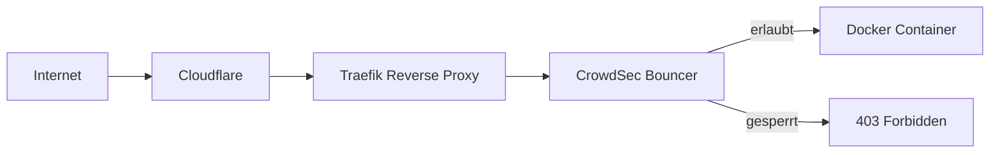
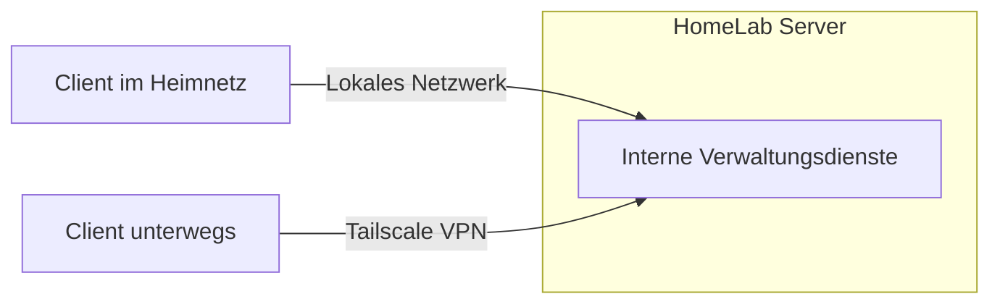

# HomeLab Dokumentation

Privates HomeLab zur praktischen Vertiefung meiner Kenntnisse im Bereich:

- Linux Administration
- Docker & Docker Compose
- Netzwerke
- Reverse Proxy & HTTPS
- Monitoring
- IT-Sicherheit

---

# Inhaltsverzeichnis

- [Netzwerk & Sicherheit](network/network-overview.md)
- [Docker & Container](docker/docker-overview.md)
- [Monitoring](docker/monitoring.md)
- [Backup & Wartung](docker/backup-maintenance.md)
- [Erfahrungen & Probleme](troubleshooting/lessons-learned.md)

---

# Hardware

| Komponenten | Beschreibung |
|---|---|
| Server | HP EliteDesk 805 G6 Mini|
| CPU | AMD Ryzen 5 PRO 4650G |
| RAM | 8 GB DDR4 |
| OS | Ubuntu 22.04.5 LTS |
| Storage | 4x12 TB HDD (RAID 5)|

---

# Verwendete Technologien

- Docker
- Docker Compose
- Traefik
- Tailscale
- CrowdSec
- Fail2Ban
- UFW
- Uptime Kuma
- Cloudflare

---

# Architektur

## Öffentlich erreichbare Dienste

## Interne Dienste

---

Dieses HomeLab wird privat betrieben und dient hauptsächlich dazu, praktische Erfahrungen im Bereich Linux, Docker und Systemadministration zu sammeln.

---

# Lizenz

Diese Dokumentation steht unter der [MIT-Lizenz](LICENSE).