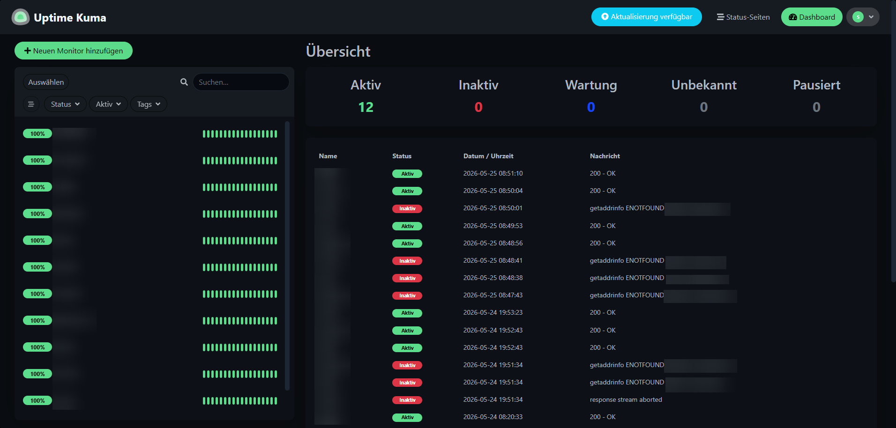
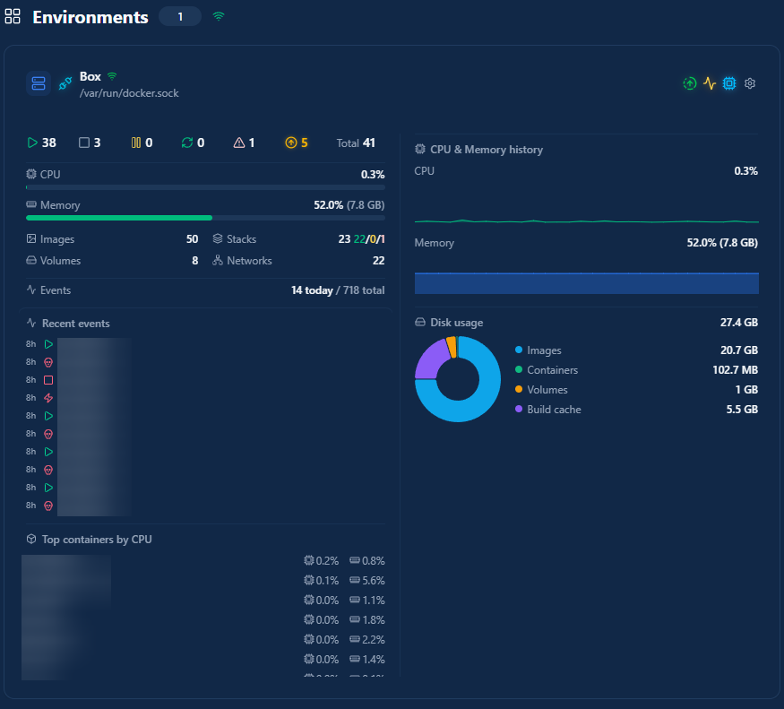

# Monitoring

Zur Überwachung der einzelnen Dienste werden verschiedene Monitoring- und Benachrichtigungssysteme verwendet.

Dadurch können Probleme oder Ausfälle schneller erkannt werden.

---

# Uptime Kuma

Uptime Kuma wird verwendet, um die Erreichbarkeit einzelner Dienste und Domains zu überwachen.

Fällt ein Dienst aus oder ist nicht erreichbar, wird automatisch eine Benachrichtigung gesendet.

Überwacht werden unter anderem:
- öffentlich erreichbare Dienste
- interne Verwaltungsdienste
- einzelne Subdomains

---

# Dockhand

Dockhand wird als Dashboard zur Verwaltung und Übersicht der Docker Container verwendet.

Zusätzlich informiert Dockhand über:
- Statusänderungen einzelner Container
- verfügbare Docker Image Updates

Container-Updates werden anschließend bewusst manuell durchgeführt.

---

# Discord Benachrichtigungen

Mehrere Dienste senden Benachrichtigungen über Discord-Webhooks.

Dazu gehören unter anderem:
- Uptime Kuma
- Dockhand
- CrowdSec
- Fail2Ban

Dadurch können Probleme oder sicherheitsrelevante Ereignisse schneller erkannt werden, ohne die jeweiligen Weboberflächen dauerhaft überwachen zu müssen.

## Beispiel: Uptime Kuma Benachrichtigung

Die Benachrichtigung enthält:

- den Namen des betroffenen Dienstes
- den aktuellen Status (z.B. "Down")
- den Zeitpunkt des Ereignisses
- die Fehlermeldung (z.B. `getaddrinfo ENOTFOUND`)

Dadurch ist auf einen Blick ersichtlich, welcher Dienst betroffen ist und wann das Problem aufgetreten ist, ohne das Uptime-Kuma-Dashboard selbst öffnen zu müssen.

---

# Ziel des Monitorings

Beim Aufbau des Monitorings war besonders wichtig:
- schnelle Erkennung von Problemen
- zentrale Benachrichtigungen
- einfache Übersicht über laufende Dienste
- möglichst wenig manueller Kontrollaufwand

---

# Weiterführend

- [Weiter: Backup & Wartung](backup-maintenance.md) - Sicherungen und regelmäßige Aufgaben
- [Zurück: Docker & Container](docker-overview.md) - Aufbau und Verwaltung der Container
- [Zurück zur Übersicht](../README.md)