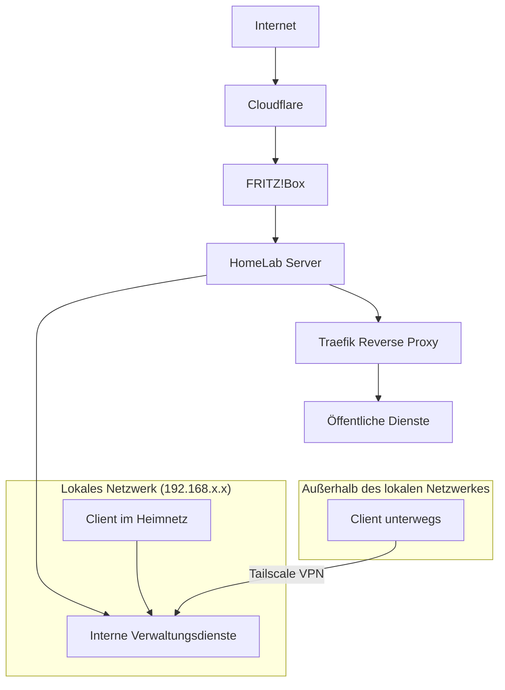

# Netzwerkübersicht

Der HomeLab Server ist per LAN mit einer FRITZ!Box verbunden und verwendet eine statische lokale IP-Adresse.

Neben dem lokalen Zugriff können einzelne Dienste auch extern erreicht werden. Dabei wird zwischen öffentlichen Diensten und internen Verwaltungsdiensten unterschieden.

## Aufbau

---

# Öffentliche Dienste

Öffentlich erreichbare Dienste laufen über eine eigene Domain mit Subdomains.

Beispiele:
- jellyfin.domain.xyz
- vaultwarden.domain.xyz
- kavita.domain.xyz

Der externe Zugriff erfolgt über einen Reverse Proxy mit HTTPS-Verschlüsselung.

## Verwendete Komponenten

| Komponente | Zweck |
|---|---|
| Cloudflare | DNS Verwaltung und HTTPS |
| Traefik | Reverse Proxy |
| Docker | Bereitstellung der Dienste|

---

# Interne Dienste

Verwaltungsdienste sind nicht direkt öffentlich erreichbar.

Der Zugriff erfolgt entweder lokal innerhalb des Netzwerkes oder, falls nötig, extern über ein VPN mit Tailscale.

Dadurch können interne Dienste sicher aus dem Heimnetz oder von unterwegs erreicht werden, ohne zusätzliche Ports öffentlich freizugeben.

## Beispiele interner Dienste

- Dockhand
- Crowdsec WebUI
- Uptime Kuma

---

# Ziel des Netzwerkaufbaus

Beim Aufbau des Netzwerks war mir besonders wichtig:
- Trennung zwischen öffentlichen und internen Diensten
- Sichere externe Erreichbarkeit
- HTTPS für öffentliche Dienste
- Möglichst wenig öffentlich freigegebene Ports
- Einfache Wartbarkeit der Container
- Zugriff auf Verwaltungsdienste über das lokale Netzwerk oder über VPN

---

# Weitere Informationen

Weitere Informationen zu Sicherheitsmaßnahmen befinden sich in der Datei [security.md](security.md).