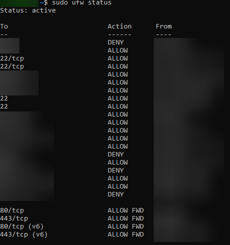
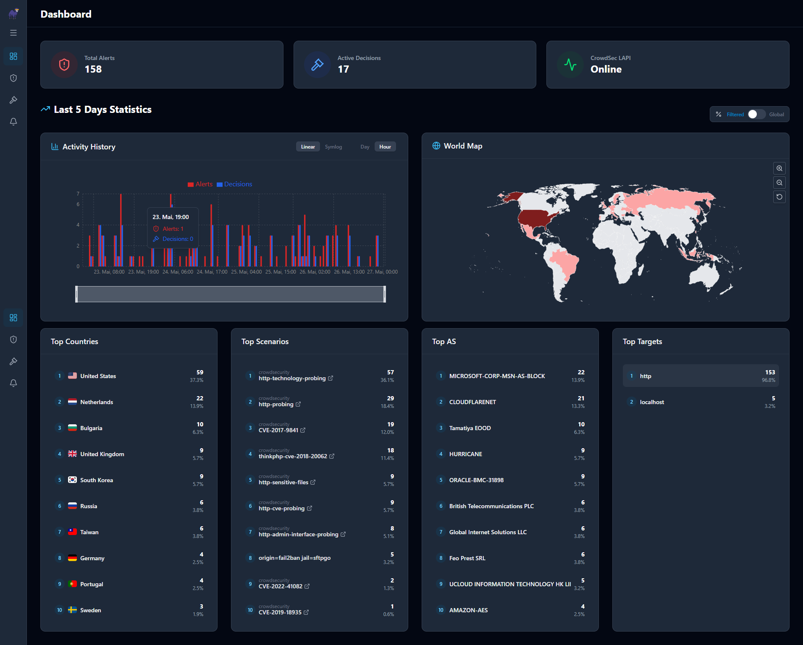

# Sicherheitsmaßnahmen

Da einzelne Dienste öffentlich erreichbar sind, war die Absicherung des Servers ein wichtiger Bestandteil beim Aufbau des HomeLab.

Dabei wurde besonders darauf geachtet:
- möglichst wenige Ports öffentlich freizugeben
- interne und öffentliche Dienste voneinander zu trennen
- Zugriffe zu überwachen
- unerwünschte Zugriffe möglichst früh zu erkennen

---

# Reverse Proxy und HTTPS

Öffentlich erreichbare Dienste laufen über Traefik als Reverse Proxy.

Die Verwaltung der Domains und HTTPS-Verbindungen erfolgt über Cloudflare.

Dadurch sind die Dienste ausschließlich verschlüsselt über HTTPS erreichbar.

---

# Tailscale VPN

Interne Verwaltungsdienste sind nicht direkt öffentlich erreichbar.

Der Zugriff erfolgt entweder lokal innerhalb des Heimnetzwerkes oder extern über ein VPN mit Tailscale.

Dadurch müssen für interne Dienste keine zusätzlichen Ports öffentlich freigegeben werden.

---

# UFW Firewall

Zur Absicherung des Servers wird UFW verwendet.

Nicht benötigte Ports sind standardmäßig blockiert.
Freigegeben werden nur die tatsächlich benötigten Dienste.

Zusätzlich werden einige Dienste bewusst nur lokal oder innerhalb bestimmter Netzwerke erreichbar gemacht.

Die Ports 80 und 443 sind nicht allgemein freigegeben, sondern ausschließlich für die IP-Ranges von Cloudflare.
Direkte Zugriffe auf die Server-IP am Reverse Proxy vorbei sind damit nicht möglich.
Da Docker veröffentlichte Ports an UFW vorbei in iptables einträgt, werden dafür `ufw route`-Regeln in Verbindung mit ufw-docker verwendet.

Entsprechend wurden auch die IPv6-Portfreigaben im Router für 80 und 443 entfernt, da diese sonst eine Umgehungsmöglichkeit dargestellt hätten.
Der SFTP-Port bleibt bewusst offen, da dieser Dienst nicht über Cloudflare läuft.

<a href="../screenshots/ufw_status.png">
  
</a>

---

# Fail2Ban

Fail2Ban wird verwendet, um Brute-Force Angriffe auf einzelne Dienste zu erkennen und IP-Adressen automatisch zu blockieren.

Besonders geschützt werden:
- SSH
- SFTPGo

Da SSH ausschließlich privat genutzt wird, wurden dafür strengere Regeln verwendet als für den gemeinsam genutzten SFTP-Dienst.

Zusätzlich sendet Fail2Ban Benachrichtigungen über Discord Webhooks.

## Beispiel: Jail-Konfiguration

Anonymisierter Ausschnitt aus `jail.local` für den SSH-Schutz:

```ini
[sshd]
enabled   = true
port      = ssh
filter    = sshd
logpath   = /var/log/auth.log
maxretry  = 3
findtime  = 10m
bantime   = 1h
```

---

# CrowdSec

CrowdSec analysiert die Zugriffslogs von Traefik und erkennt auffällige Muster wie Path-Scanning, CVE-Probing oder Crawling.
Erkannte IP-Adressen werden für eine definierte Dauer gesperrt.

Bei einer Überprüfung der Konfiguration fiel auf, dass CrowdSec zwar Sperren erzeugt und darüber benachrichtigt, diese aber nicht durchgesetzt wurden:
Der Bouncer war nicht bei der lokalen API registriert und die Middleware nicht in Traefik eingebunden.
Gesperrte IP-Adressen konnten die Dienste weiterhin erreichen. Zusätzlich sah CrowdSec durch den vorgeschalteten Cloudflare-Proxy
nicht die tatsächlichen Client-Adressen.

Die folgenden Anpassungen wurden daraufhin vorgenommen:

Die Sperren werden über den Traefik-Bouncer durchgesetzt, der als ForwardAuth-Middleware am HTTPS-Entrypoint hängt und damit für alle öffentlichen Dienste greift.
Ohne Bouncer würde CrowdSec Sperren zwar erkennen und speichern, aber nicht anwenden.

Damit CrowdSec die tatsächlichen Client-IPs sieht und nicht die Cloudflare-Edge-Server, sind in Traefik die Cloudflare-Ranges als vertrauenswürdige Proxys hinterlegt (`forwardedHeaders.trustedIPs`).
Ohne diese Einstellung würden Cloudflare-IPs gesperrt und damit legitime Besucher ausgeschlossen.

Eigene Adressen sind über einen lokalen Whitelist-Parser ausgenommen, um versehentliche Selbstsperren zu vermeiden.

Zur einfacheren Verwaltung und Übersicht wird zusätzlich die CrowdSec WebUI verwendet.
<a href="../screenshots/crowdsec_webui.png">
  
</a>

Auch CrowdSec sendet Benachrichtigungen über Discord Webhooks.

---

# Wartung

Die IP-Ranges von Cloudflare ändern sich gelegentlich. Ein Skript prüft täglich per Cron die offizielle API und meldet Abweichungen über einen Discord-Webhook,
damit Firewall- und Traefik-Konfiguration angepasst werden können.

---

# Weitere Informationen

Weitere Informationen zum allgemeinen Netzwerkaufbau befinden sich in der Datei [network-overview.md](network-overview.md).